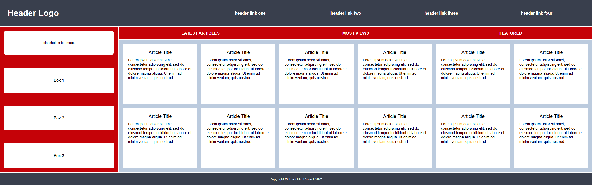

Creating a Holy Grail Mockup with CSS GRID

Hints
For this exercise you will need to add some CSS declaration blocks to the style.css file. Look through the HTML to see what selectors and combinators you can use.
Take the layout one section at a time
You don't need to add or change anything to the HTML, but it will be helpful to look through the parent and child relationships between elements
Just like with Flexbox, you can easily center an item by making it into a grid
Don't worry about the placeholder image element stretching when resizing the browser window. This will be covered in the Responsive lessons

Desired Outcome

.png>)

If you use the tools in the Advanced Grid Properties lesson you should be able to get your article cards to automatically fit as the browser window is adjusted:

